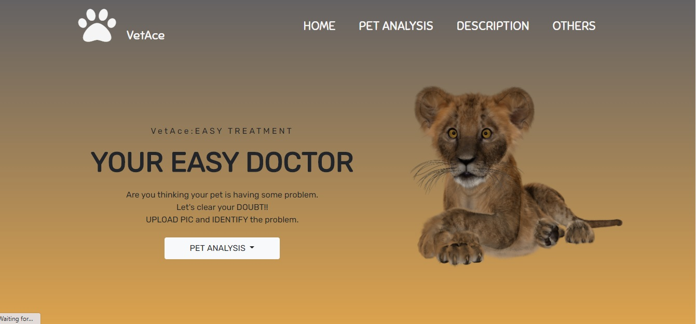
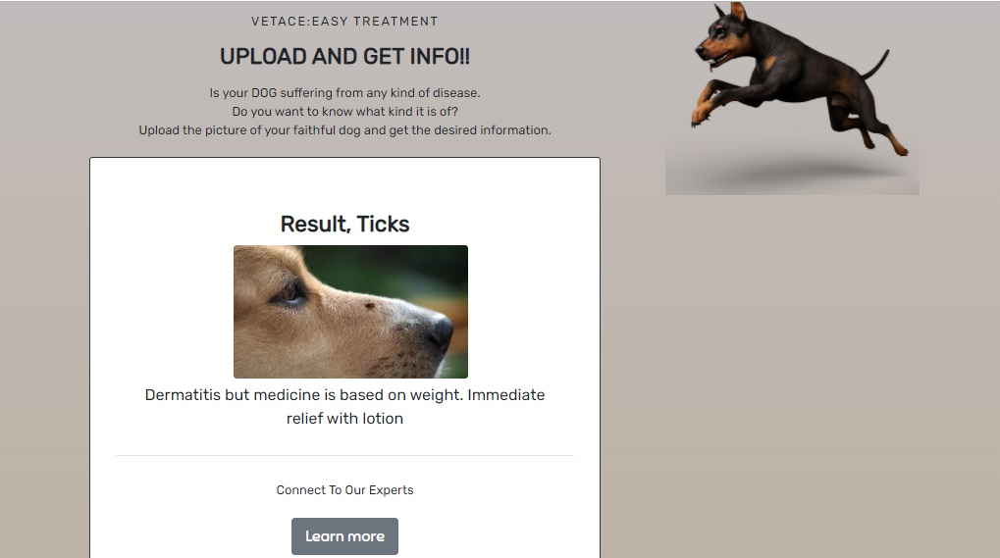
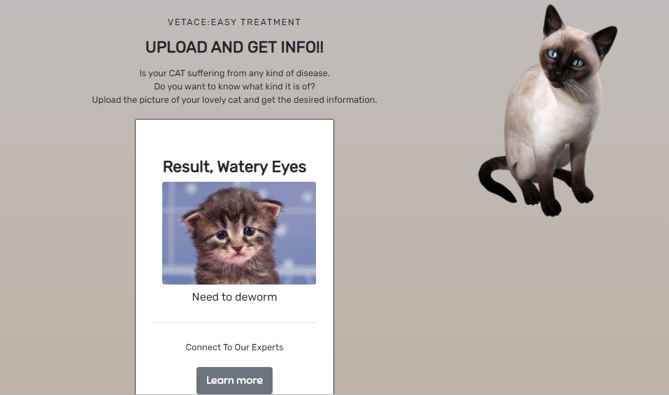
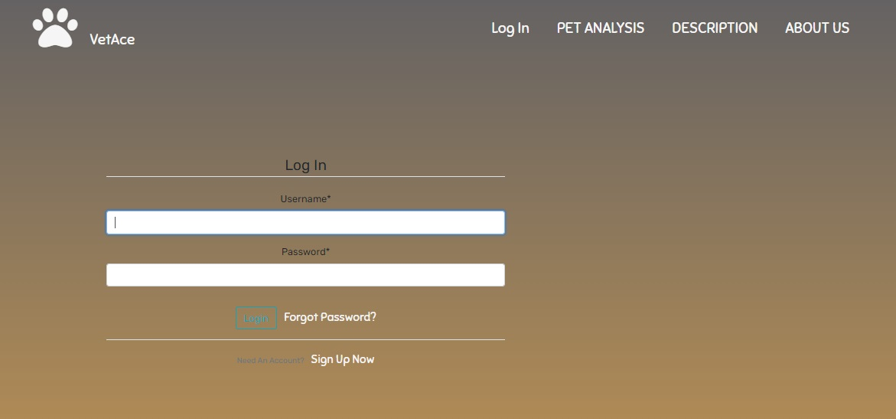
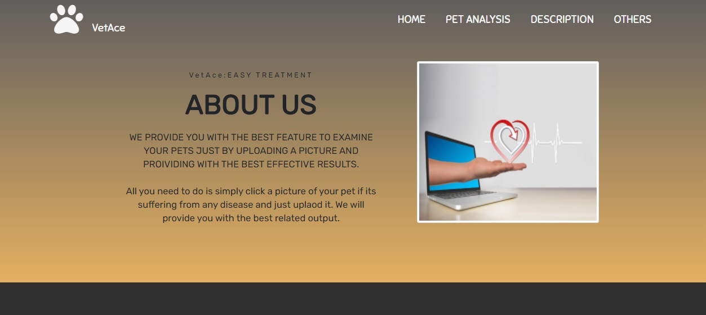
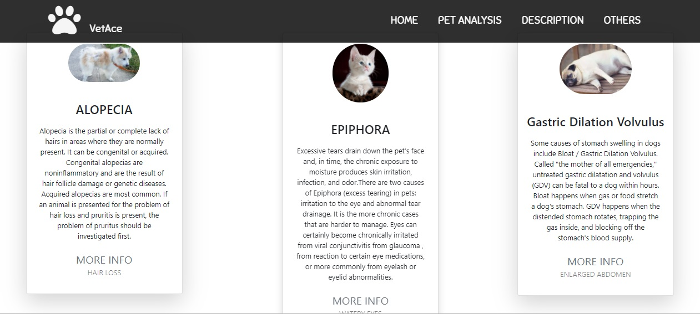
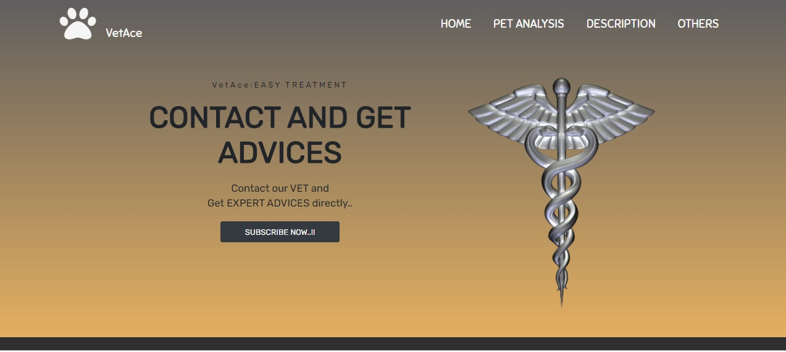

# VetAce
## We got your pets, no need for vets

We have created a user friendly website on which you can get your pet examined for any disease just by clicking the picture, uploading it and the results will be displayed instantenously.

We know how much you love your pet and how hard it is for you to see him suffer. Going out to meet a vet in this pandemic times is not a good idea. We are at your help. Just do two steps of 
<br>
1) Click the picture of abnormal part (Eyes, skin, legs) of pet
2) Upload that picture and wait for a second.
<br>

If your pet has any disease AI will show you the name and short description of disease, along with some cures, medicines that are given in this case. If our AI thinks that your pet has some serious disease it will tell you to contact vet asap. You can always have second opining from our Vet, if you have premium subscription.


## To run/ Setup over local system 
1.) Clone the repo using command:
```bash
git clone https://github.com/manjotsinghbagha/HackAce.git
```
2.) Download model to main directory from link: https://drive.google.com/drive/folders/1ItbzWmwGfkK4agVlVYYF7PrewPwPZwce?usp=sharing                                    
2.) Create a virtual environment in python and run following
```bash
pip install -r requirements.txt
python manage.py runserver
```
Congratulation you are all set :partying_face:

## Problem solved and Solution:

### Problem

1) COVID-19 : In the current scenario of COVID-19 it is extremly difficult to take your diseased pet to consult a vet. The more people come in contact, the more chances of you getting the disease. 
2) Unaffordable bills: All of us who have pets know that medical care for pets is highly costly and some people won't be able to afford that. High consultation charges makes monthly checkup of pets less probable and this is not even thought of.
3) Travelling pain: Your pet might not love the polluted air on city roads. Pets get irritated while owners are taking them outside to consult a vet. Pets need to rest if they are diseased.
4) While waiting for the turn, your pet will come in contact with certain another animals who might have  contagious disease and there is a chance that your pet might catch some serious disease due to it.
5) Monthly checkups for human are a known term, but by using our application people can do monthly checkup of their pets and that cost free.


### Solution:

VetAce is a web based app solution in which a user can:  
  1) Click the pic of pet.
  2) Upload to our website.  
  3) Our Web app uses AI that will predict the disease from the picture you uploaded.  
  4) As an output you will see the disease name, description of the disease, steps to take care of your pet, pre treatment steps, medicines that are needed to be given and somehyperlinks which you can refer to cure the disease.   
  5) If our AI thinks that the disease is pretty serious, it will suggest you to visit the vet as soon as possible.
  6) We have a subscription model, if you are our subscriber we will provide opinion of vet. 
 


### Machine learning part

We had trained a Multi Class Classifier Convolution neural network model over 5 broad categories (Hair loss, Loss of Apetite, Ticks, patches on body, watery eyes).  The model is trained over 75 epochs, Adam optimizer with 0.001 learning rate and used 6 layered CNN. We had trained 2 different models, one for Dogs and other for cats. Further we could scaled it to as many disease and animals as we want. In future we can train the machine learning model with more number of images so that the prediction accuracy of the model improves.  

Currently we can classify the diseases in animal in 5 categories but later on we can use more data and computational power to train a better model which can
classify more diseases with respect the different animals.  

Along with this application is full of information. It provides the user with all the information related to the diseases commonly found in domestic animal(cat and dog).  


## Market feasibility and Buisness model
This website/software can generate revenue through these models:

### Software as a service Model for Vet
The software or website will be given as a service to various veterinary doctor to track development and improvement in animals of their potential coutomers.
VET can look after them regularly with physical meeting and can provide with the best treatment possible. they can provide suggestions to owner how they can look after and cure the disease in minimal time. through our portal.  
We will use django-tenant-model to register every VET as a tenant and every tenant will have his/her private patients.  
This dieticians will be asked to pay for our service.

### Advertisement Model
Here we could advertise some shops from where pet goods, medicine or curing material could be bought and also could promote specific VET on basis of their subscription and requirement.

## Video link for demo
https://youtu.be/7Z6bN4EeqvM

## Screenshots
<div display=table; clear=both class="row">








</div>

### Made with love from:
<br>
Team CreatorsSquad

